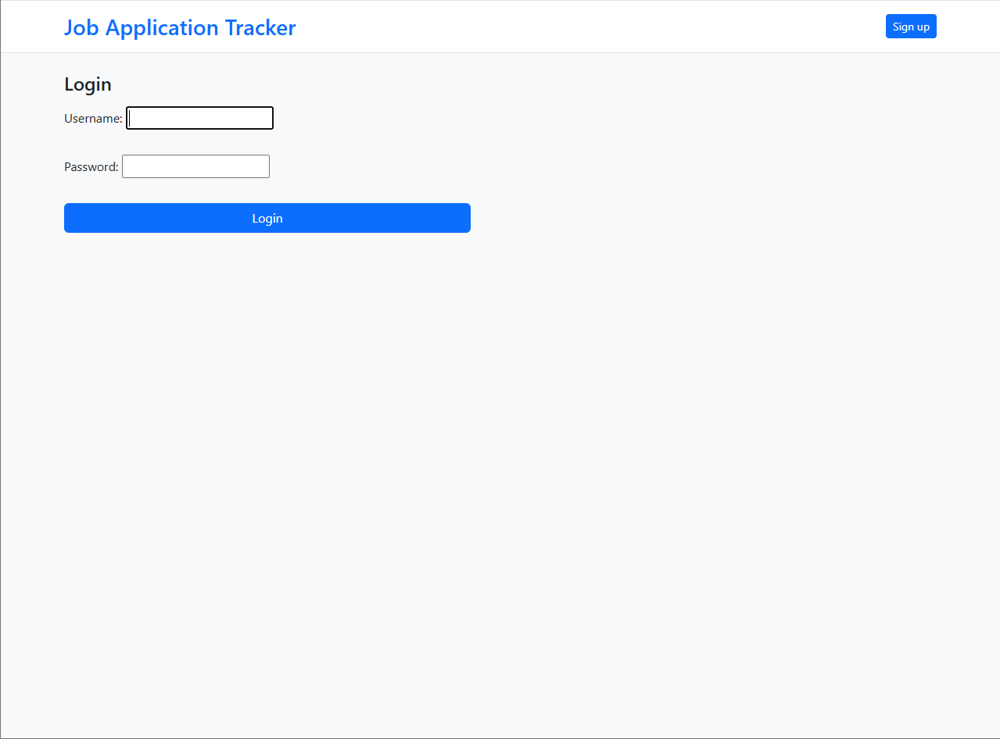
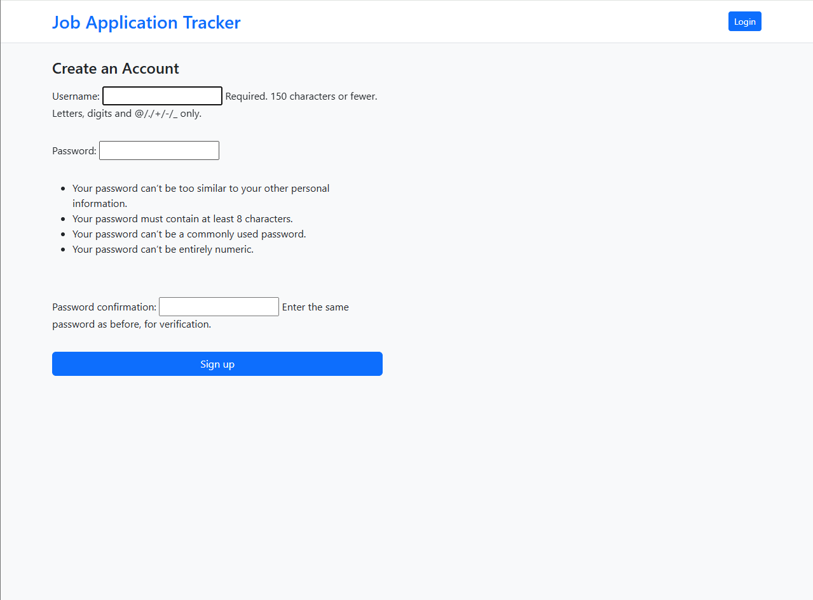
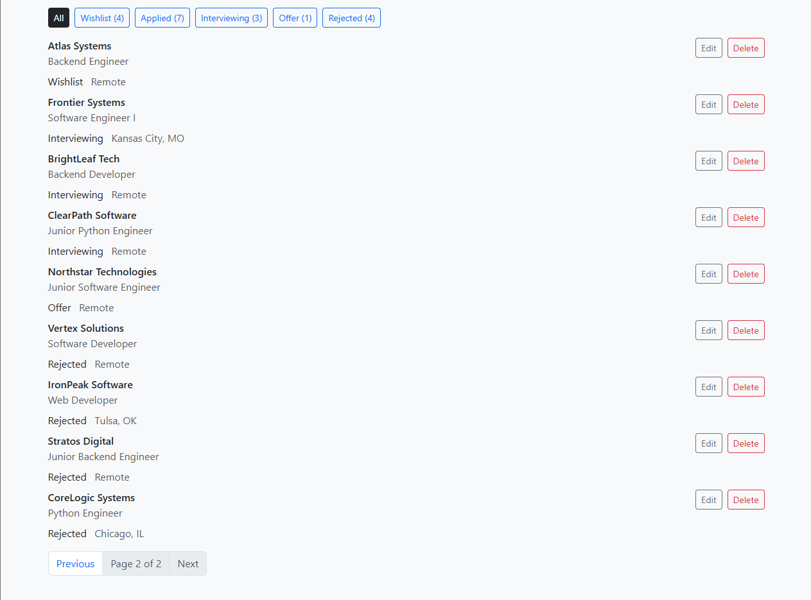
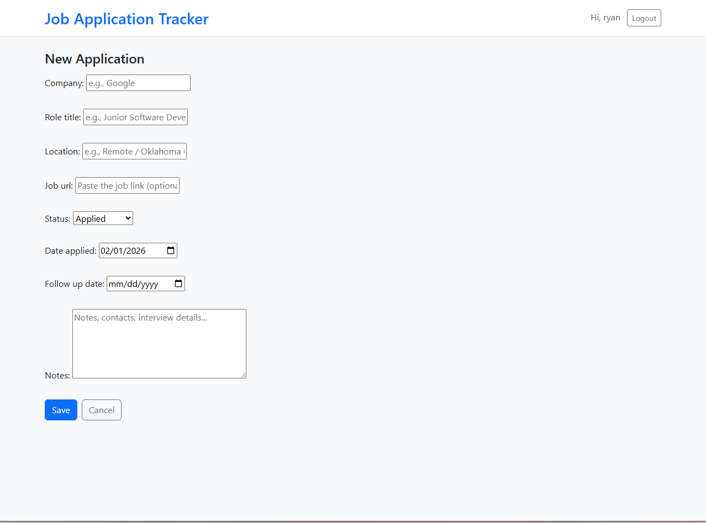
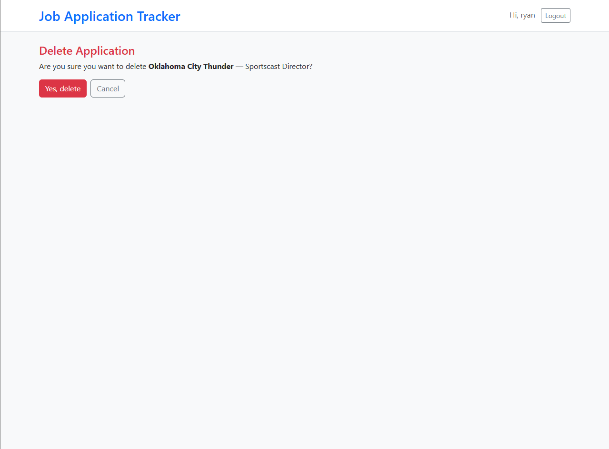

# Job Application Tracker

A Django web application for tracking job applications, statuses, and follow-ups. Users can create an account, manage their own applications, and quickly filter/search by status and keyword.

## Features
- User authentication (signup/login/logout)
- Per-user data isolation (users only see their own applications)
- CRUD: create, edit, delete applications
- Search by company or role title
- Status-based navigation with counts
- Pagination for longer lists

## Tech Stack
- Python
- Django
- SQLite
- Bootstrap 5

## Screenshots

### Login


### Signup


### Application List


### New Application Form


### Delete Application


## Setup (Local)

1. Clone the repo and `cd` into it
2. Create and activate a virtual environment
3. Install dependencies:
   ```bash
   pip install -r requirements.txt
