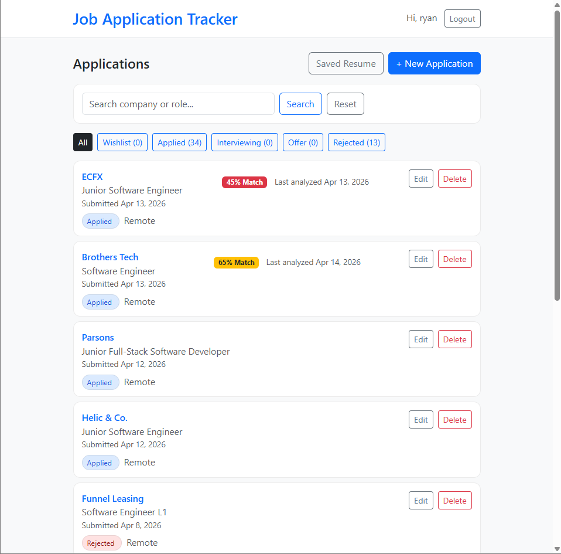
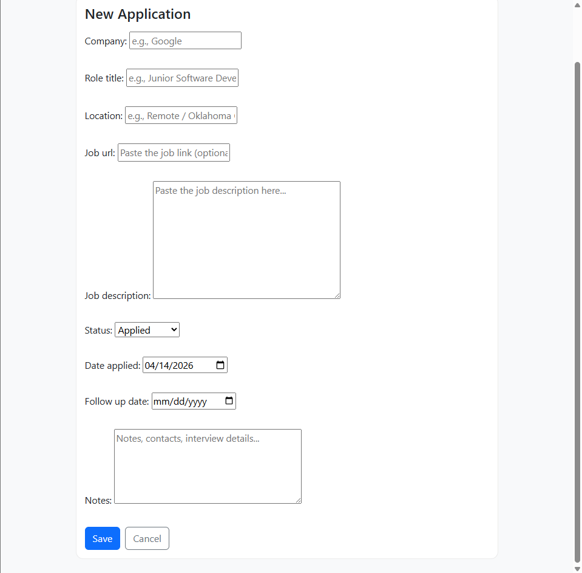
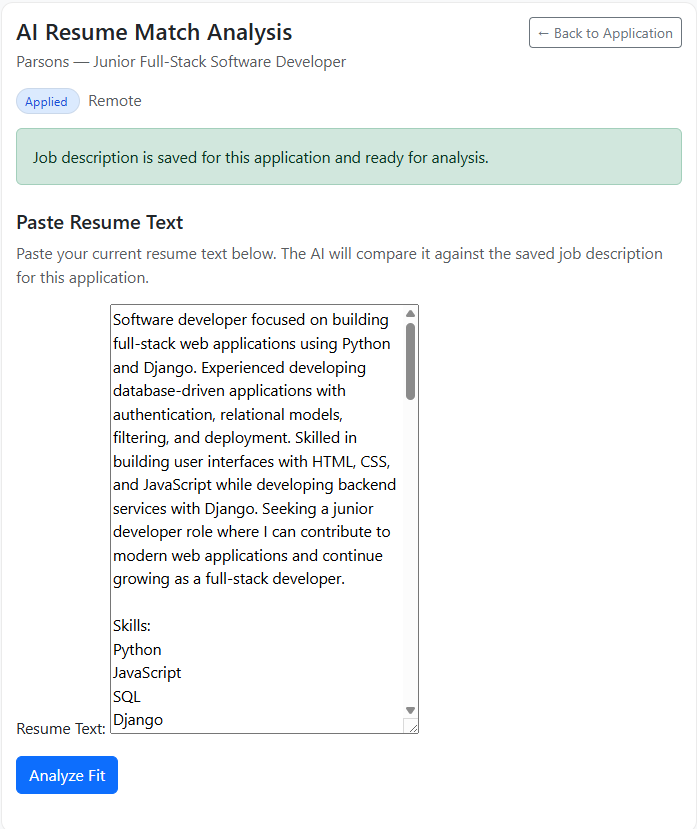
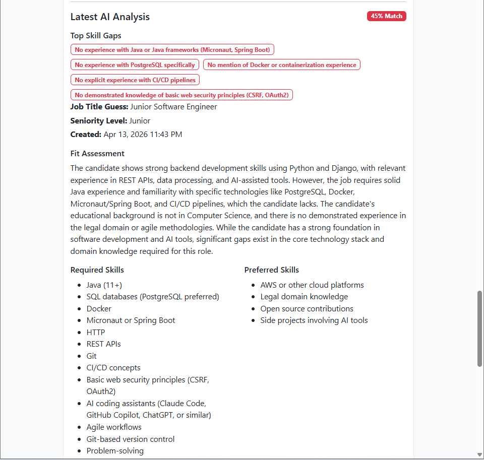

# Job Application Tracker

A Django web application for tracking job applications, statuses, and follow-ups. Users can create an account, manage their own applications, and quickly filter/search by status and keyword.

## Features
- User authentication (signup/login/logout)
- Per-user data isolation (users only see their own applications)
- CRUD: create, edit, delete applications
- Search by company or role title
- Status-based navigation with counts
- Pagination for longer lists

### AI Resume Match Analysis
- Analyze how well your resume matches a specific job description
- Save a base resume once and auto-fill it for future analyses
- Generate a match score (0–100%) with color-coded feedback
- View required vs preferred skills extracted from job descriptions
- Identify top skill gaps highlighted for quick review
- Get tailored resume improvement suggestions
- Automatically track the latest analysis per application

## Tech Stack
- Python
- Django
- SQLite
- Bootstrap 5
- OpenAI API (AI-powered analysis)
- python-dotenv (environment variable management)

## Screenshots

### Application List


### New Application Form


### AI Analysis Page


### Resume Match Results


## Setup (Local)

1. Clone the repo and `cd` into it
2. Create and activate a virtual environment
3. Install dependencies:
   ```bash
   pip install -r requirements.txt
4. Create a `.env` file in the root directory and add your OpenAI API key:
5. Run the development server:
```bash
python manage.py runserver